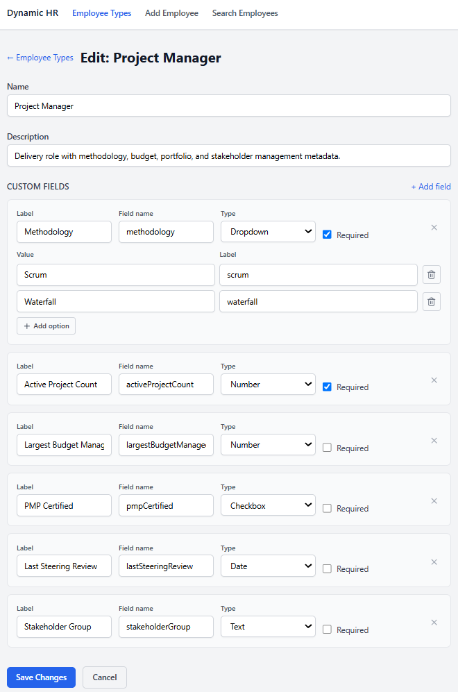
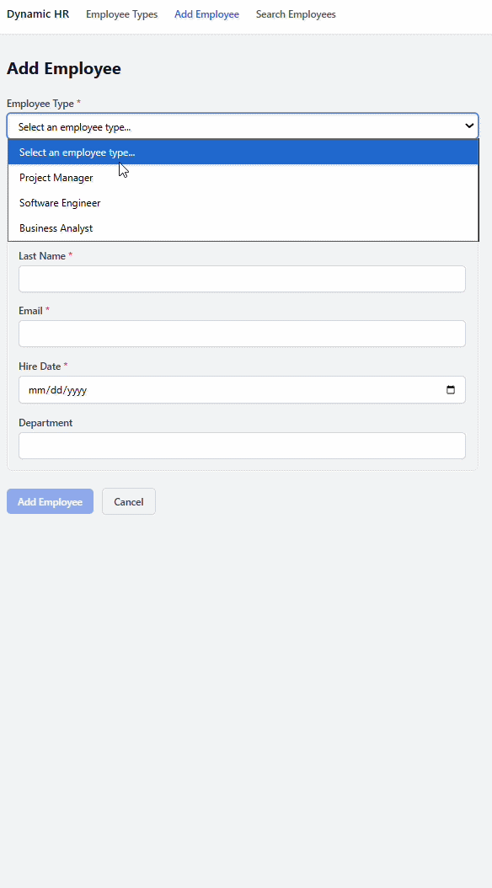
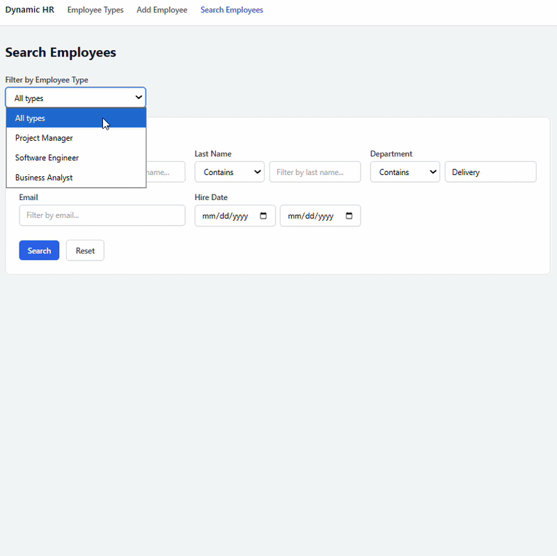
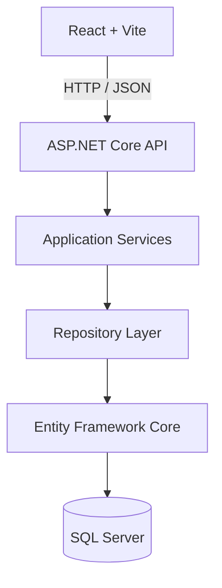
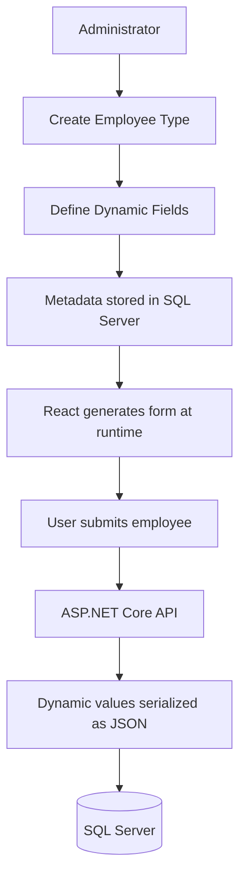
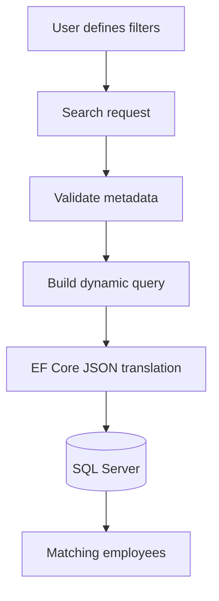

# Dynamic HR Demo

Dynamic HR Demo is a full-stack sample application for metadata-driven employee records. It lets an admin define employee types at runtime, attach custom fields to each type, create employees from those schemas, and search across both normal columns and JSON-backed dynamic values.

The point of the project is not just CRUD. It demonstrates how a product can offer flexible user-defined fields while still keeping a clean backend architecture, SQL Server persistence, provider-specific EF Core JSON translation, automated tests, and a React UI that is usable enough to show the flow end to end.

It also serves as a proof-of-concept, real-world example of how to use the Dynamic.Json packages developed in the [`dynamic-json-efcore`](https://github.com/jfairbourn96/dynamic-json-efcore) repository, including [`Dynamic.Json.Search`](https://www.nuget.org/packages/Dynamic.Json.Search), [`Dynamic.Json.EfCore.SqlServer`](https://www.nuget.org/packages/Dynamic.Json.EfCore.SqlServer), and [`Dynamic.Json.AspNetCore`](https://www.nuget.org/packages/Dynamic.Json.AspNetCore).


## Screenshots

**Define employee types and their runtime-configurable fields.**



**Generate an employee form from the selected type's metadata.**



**Filter employees using standard and dynamically defined fields.**



## What This Demonstrates

- Runtime-defined employee schemas with text, number, date, boolean, and select fields.
- JSON-backed dynamic field values persisted through EF Core.
- SQL Server search over dynamic JSON fields using the published `Dynamic.Json` packages.
- Clean architecture boundaries between API, application services, domain models, and EF Core infrastructure.
- React + TypeScript forms generated from backend metadata.
- Unit and Docker-backed SQL Server integration tests.
- GitHub Actions for backend/frontend CI, coverage reporting, and package publishing.

---

## Application Architecture

The application follows a layered architecture with clear separation of responsibilities.



This separation allows the dynamic metadata engine, persistence layer, and API surface to evolve independently while keeping business logic isolated from infrastructure concerns.

---

## Testing Strategy

The repository includes both fast unit tests and Docker-backed integration tests.

- **Unit tests** validate business logic in isolation.
- **Integration tests** execute against a real SQL Server container using Testcontainers to verify EF Core mappings, migrations, JSON translation, and repository behavior.

## Continuous Integration

Every pull request automatically validates the application using GitHub Actions.

Running integration tests against a real SQL Server instance ensures that migrations, EF Core configuration, and dynamic JSON translation behave exactly as they do in production.

---

## Why This Project Exists

Most ORMs assume database schemas are known at compile time.

This project explores a different problem:

> **How can applications support runtime-defined schemas while still preserving a strongly-architected backend, SQL-backed querying, and maintainable code?**

Rather than treating JSON columns as simple serialized blobs, this solution demonstrates how metadata can drive:

- Runtime form generation
- Dynamic validation
- Dynamic persistence
- SQL-backed filtering
- Clean application architecture

The goal is not simply to build another CRUD application, but to demonstrate the kinds of architectural challenges encountered when designing extensible enterprise software.

## Run With Docker

With Docker Desktop or Docker Engine installed, start the complete stack with one command:

```powershell
docker compose up --build
```

Compose starts SQL Server by default, applies EF Core migrations when the API starts, loads the professional demo data on a fresh database volume, serves the API, and builds the React frontend behind nginx. Open [http://localhost:5173](http://localhost:5173).

The API is also available directly at `http://localhost:5154`. The seed container skips its scripts when employee types already exist, so it never overwrites a running demo database. Stop the stack with `docker compose down`; add `-v` to remove the persisted SQL Server data volume and seed a fresh database on the next start.

For a non-default development SQL Server password, create a root `.env` file containing `MSSQL_SA_PASSWORD=your-strong-password` before starting Compose.

To run the same application against PostgreSQL instead, stop the default stack and explicitly start the PostgreSQL services:

```powershell
docker compose --profile postgres up --build postgres api-postgres seed-postgres frontend-postgres
```

This uses the same API and frontend images, applies the PostgreSQL migrations, and loads an idempotent `jsonb`-backed demo dataset. Stop it with `docker compose --profile postgres down`; add `-v` to remove its persisted volume. Set `POSTGRES_PASSWORD` in `.env` to override the development-only default.

## Quick Start Without Docker

Prerequisites: .NET SDK 10.x, Node.js 20 or 22, npm 10.x, and Docker Desktop or Docker Engine for the recommended SQL Server workflow and integration tests. Another SQL Server instance can also be used with an overridden connection string.

```powershell
git clone https://github.com/jfairbourn96/dynamic-hr-demo.git
cd dynamic-hr-demo

dotnet restore backend\DynamicEmployeeApi\DynamicEmployeeApi.sln
dotnet build backend\DynamicEmployeeApi\DynamicEmployeeApi.sln
dotnet test backend\DynamicEmployeeApi\DynamicEmployeeApi.sln --no-build

dotnet ef database update `
  --project backend\DynamicEmployeeApi\Dynamic.Employees.Data `
  --startup-project backend\DynamicEmployeeApi\EmployeeApi `
  --context EmployeeDbContext
```

Run the API:

```powershell
dotnet run --project backend\DynamicEmployeeApi\EmployeeApi\EmployeeApi.csproj
```

Run the frontend:

```powershell
cd frontend
npm install
npm run dev
```

Default local URLs:

- API: `http://localhost:5154`
- Frontend: `http://localhost:5173`

## Project Layout

```text
backend/DynamicEmployeeApi/
  Dynamic.Employees.Domain/       Employee domain models and enums
  Dynamic.Employees.Application/  Use-case services, commands, search models, and repository ports
  Dynamic.Employees.Data/         EF Core DbContext, migrations, configurations, and repository implementations
  EmployeeApi/                    ASP.NET Core controllers, request/response DTOs, mapping, and composition
  EmployeeApi.UnitTests/          API controller and mapping unit tests

frontend/
  src/                            React UI for employee types, dynamic forms, and search
```

## Tech Stack

| Area | Technology |
|---|---|
| API | ASP.NET Core, controllers, dependency injection |
| Application | C# services, repository ports, dynamic search orchestration |
| Persistence | EF Core 10, SQL Server, JSON-backed dynamic values |
| Dynamic JSON | `Dynamic.Json.Search`, `Dynamic.Json.EfCore.SqlServer`, `Dynamic.Json.AspNetCore` |
| Frontend | React 19, TypeScript, Vite, Tailwind CSS, TanStack Query |
| Tests | xUnit, FluentAssertions, Moq, AutoFixture, Testcontainers for SQL Server |
| CI | GitHub Actions, coverage report generation, frontend lint/build |

## How The Dynamic Model Works

### Dynamic Metadata Flow

Rather than hardcoding employee fields into C# models or React components, administrators define metadata that drives both the UI and persistence model.



This approach enables new employee types and fields to be introduced without changing the underlying database schema or deploying new application code.

### Search Flow



## Architecture Decisions

The backend follows the dependency direction used in clean architecture:

```text
EmployeeApi -> Dynamic.Employees.Application
EmployeeApi -> Dynamic.Employees.Data.SqlServer
Dynamic.Employees.Application -> Dynamic.Employees.Domain
Dynamic.Employees.Data -> Dynamic.Employees.Application
Dynamic.Employees.Data -> Dynamic.Employees.Domain
Dynamic.Employees.Data.SqlServer -> Dynamic.Employees.Data
Dynamic.Employees.Data.PostgreSql -> Dynamic.Employees.Data
```

`Dynamic.Employees.Domain` has no ASP.NET Core, EF Core, SQL Server, or Dynamic.Json package references. It contains the core employee model only.

`Dynamic.Employees.Application` owns use-case orchestration. It defines commands, search criteria/results, service interfaces/implementations, and repository ports such as `IEmployeeSearchRepository`, `IEmployeeReader`, and `IEmployeeWriter`.

`Dynamic.Employees.Data` implements those ports with provider-neutral EF Core repositories and shared entity configuration. It contains no SQL Server or PostgreSQL package reference.

`Dynamic.Employees.Data.SqlServer` and `Dynamic.Employees.Data.PostgreSql` own their concrete contexts, provider registration, Dynamic.Json translators, dependencies, and independent migrations. PostgreSQL maps both dynamic values and owned field metadata to native `jsonb`.

`EmployeeApi` is the delivery layer. It owns controllers, HTTP request/response DTOs, mapping extensions, and dependency injection composition. It does not own EF Core migrations or the concrete DbContext.

## Repository Ports

The application layer uses narrow repository ports instead of one large CRUD repository:

- `IEmployeeSearchRepository` handles the JSON-backed employee search use case.
- `IEmployeeReader` handles employee reads.
- `IEmployeeWriter` handles employee writes.
- `IEmployeeTypeReader` and `IEmployeeTypeWriter` split employee type reads from writes.

The EF implementation can still be one concrete class per aggregate area, for example `EfEmployeeRepository`, but it implements several small interfaces. This keeps use cases dependent only on the capabilities they need.

Write methods persist internally, so the application services do not call `SaveChangesAsync` or depend on EF-style unit-of-work details.

## Dynamic.Json Dependencies

The backend consumes the published Dynamic.Json preview packages:

- [`Dynamic.Json.Search`](https://www.nuget.org/packages/Dynamic.Json.Search) `0.3.0-preview.1` in Application.
- [`Dynamic.Json.EfCore.SqlServer`](https://www.nuget.org/packages/Dynamic.Json.EfCore.SqlServer) `0.3.0-preview.1` in the SQL Server data project.
- `Dynamic.Json.EfCore.PostgreSql` `0.3.0-preview.1` in the PostgreSQL data project.
- [`Dynamic.Json.AspNetCore`](https://www.nuget.org/packages/Dynamic.Json.AspNetCore) `0.3.0-preview.1` in EmployeeApi.

## Search Examples

Core field filters:

```text
GET /api/employees/search?department_exact=Field%20Ops&hireDate_startDate=2024-01-01&pageNumber=1&pageSize=20
```

Dynamic field filters require an `employeeTypeId` so the backend can validate the requested fields against that type's metadata:

```text
GET /api/employees/search?employeeTypeId={id}&certificationLevel=senior&remoteEligible=true&hourlyRate_gte=75
```

Supported dynamic field categories are text, number, date, boolean, and select. Invalid field names, unsupported operators, bad number/date/boolean values, and invalid select options return validation errors instead of falling through to ambiguous SQL behavior.

## Migrations

Migrations are isolated by provider. For SQL Server:

```powershell
dotnet ef migrations add MigrationName `
  --project backend\DynamicEmployeeApi\Dynamic.Employees.Data.SqlServer `
  --context SqlServerEmployeeDbContext
```

```powershell
dotnet ef database update `
  --project backend\DynamicEmployeeApi\Dynamic.Employees.Data.SqlServer `
  --context SqlServerEmployeeDbContext
```

For PostgreSQL, substitute its provider project and context:

```powershell
dotnet ef migrations add MigrationName `
  --project backend\DynamicEmployeeApi\Dynamic.Employees.Data.PostgreSql `
  --context PostgreSqlEmployeeDbContext
```

```powershell
dotnet ef database update `
  --project backend\DynamicEmployeeApi\Dynamic.Employees.Data.PostgreSql `
  --context PostgreSqlEmployeeDbContext
```

The API selects persistence with `Database:Provider`, accepting `SqlServer` or `PostgreSql`. SQL Server is the backward-compatible default. Each provider reads its matching named connection string (`ConnectionStrings:SqlServer` or `ConnectionStrings:PostgreSql`), owns its migrations, and registers its Dynamic.Json translator. Compose supplies these settings for the selected stack.

## Tests

Backend tests:

```powershell
dotnet test backend\DynamicEmployeeApi\DynamicEmployeeApi.sln
```

The integration test project uses Testcontainers for SQL Server and PostgreSQL provider persistence, migrations, and JSON behavior.

Coverage:

```powershell
dotnet test backend\DynamicEmployeeApi\Dynamic.Employees.Application.UnitTests\Dynamic.Employees.Application.UnitTests.csproj --settings backend\DynamicEmployeeApi\coverlet.runsettings --results-directory artifacts\coverage\raw\application --collect "XPlat Code Coverage"
dotnet test backend\DynamicEmployeeApi\Dynamic.Employees.Data.UnitTests\Dynamic.Employees.Data.UnitTests.csproj --settings backend\DynamicEmployeeApi\coverlet.runsettings --results-directory artifacts\coverage\raw\data --collect "XPlat Code Coverage"
dotnet test backend\DynamicEmployeeApi\EmployeeApi.UnitTests\EmployeeApi.UnitTests.csproj --settings backend\DynamicEmployeeApi\coverlet.runsettings --results-directory artifacts\coverage\raw\api --collect "XPlat Code Coverage"
```

CI generates an HTML/Cobertura coverage report from the backend unit test suites, publishes the Markdown summary to the GitHub Actions job summary, uploads the full report as a `coverage-report` artifact, and runs frontend lint/build checks.

Coverage notes for the backend live in `docs/test-coverage.md`.
